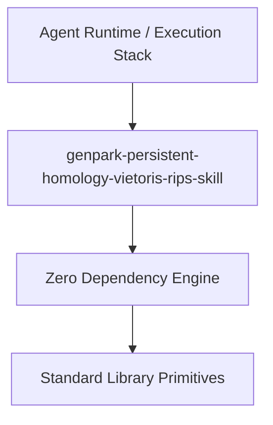

# genpark-persistent-homology-vietoris-rips-skill

[](https://github.com/alphaparkinc/genpark-persistent-homology-vietoris-rips-skill)
[](https://github.com/alphaparkinc/genpark-persistent-homology-vietoris-rips-skill)
[](https://www.python.org/)

Topological Data Analysis (TDA) Vietoris-Rips filtration generator tracking metric space topological features across expanding radii.



## Features
- **Strict 0 Pip Dependencies**: Built completely using the Python Standard Library.
- **Fast Execution & Verification**: Includes client wrapper, MCP server, and verified test suites.
- **Agentic AI Ready**: Exposes standard MCP tools for continuous LLM integration.

## Installation & Quickstart
```bash
git clone https://github.com/alphaparkinc/genpark-persistent-homology-vietoris-rips-skill.git
cd genpark-persistent-homology-vietoris-rips-skill
python example_usage.py
```
